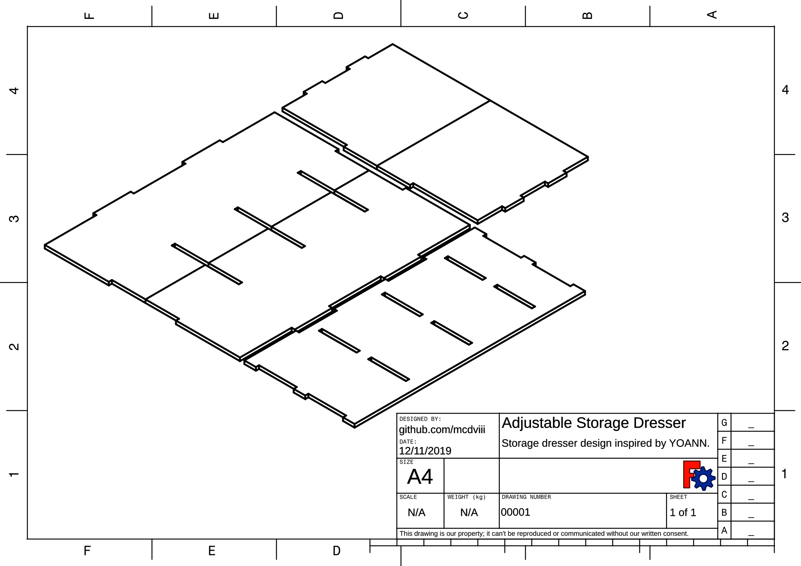

# FreeCAD Adjustable Storage Dresser

Adjustable storage dresser designed in FreeCAD. Design inspired by a [drawing found on
3axis.co](https://3axis.co/small-dresser-storage-mdf-4mm-8mmdxf-file/d1ledz7m/), created by YOANN.

## Goals/Features:

The aim of this project is to make a CAD file with all necessary shapes to make
a storage dresser & drawers. Additional goals are:

- Adjustable for all material thicknesses.
- Fully automated tab depth adjustment (changing material thickness changes tab
  depth by default).
- All dimensions kept in an associated spreadsheet for easy adjustment & repurposing.
- Shapes should hold true under any input dimension.
- All fitment features (such as tab width & drawer depth) should automatically
  be calculated from:
  - Dresser Height
  - Dresser Width
  - Dresser Depth

  - Drawer Height
  - Drawer Width
  - Drawer Count Up
  - Drawer Count Across 

## ToDO:

- [ ] Fix "Dresser Side" sketch so that it conforms to the rest of the dresser
      solid dimensions.
- [ ] Finish adding all relavant constraints to all solids, re-adding or
      removing constraints as necessary.
- [ ] Clean up spreadsheet calculations (remove redundancy).
- [ ] Confirm placement of each solid is calculated through its neighbor, in such a way that
      changing dimensions doesn't shift parts closer (or further away) from its neighbor.
- [ ] Tie drawer number to some kind of array mechanism, so that shelf count
      & dresser width can be added through the spreadsheet.
